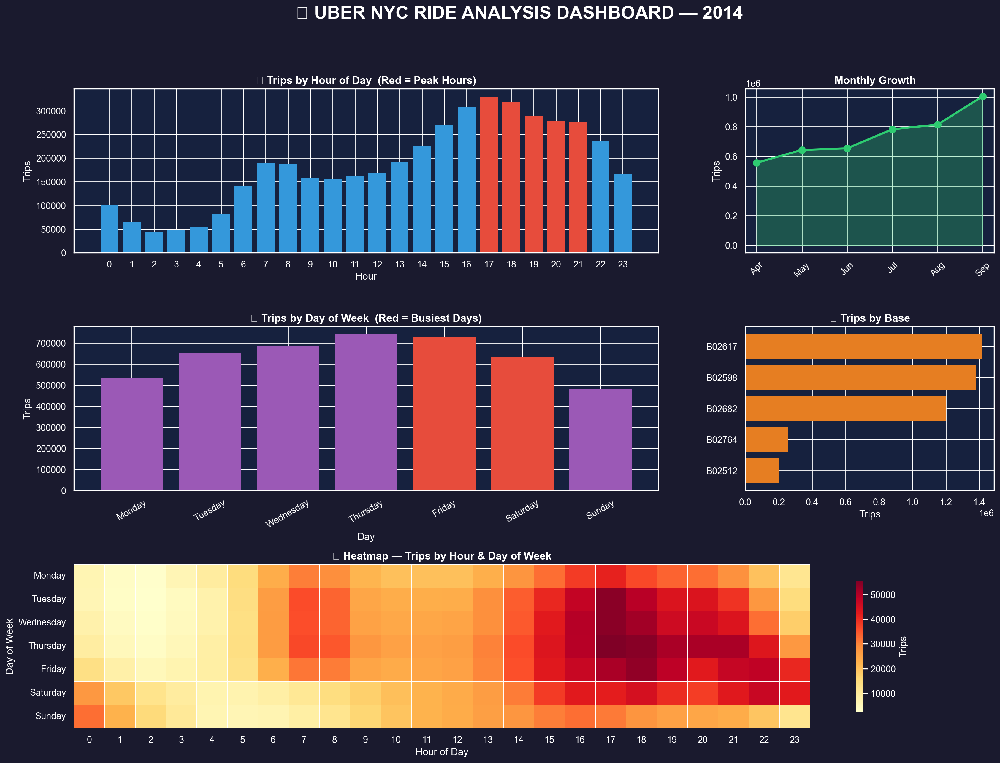
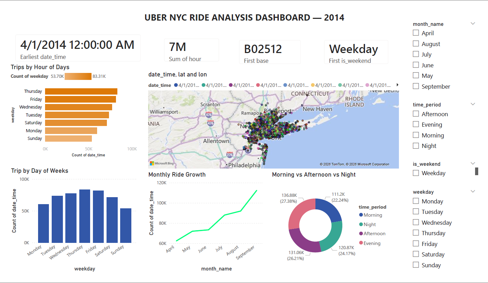

# 🚗 Uber NYC Ride Analysis — Data Analytics Project


## 📌 Project Overview
Analyzed **4.5 million+** Uber ride records from New York City (April–September 2014)
to uncover demand patterns, peak hours, high-demand locations, and growth trends —
simulating a real-world Uber data analyst workflow.

---

## 🎯 Key Objectives
- Identify **peak booking hours** and **busiest days**
- Analyze **high-demand geographic zones** in NYC
- Track **monthly ride growth** trends
- Build an **interactive Power BI dashboard** for business insights

---

## 📊 Key Insights Discovered
| Insight | Finding |
|--------|---------|
| 🕐 Peak Hour | 5PM – 6PM (Evening Rush) |
| 📅 Busiest Day | Thursday & Friday |
| 📈 Growth | 40%+ demand increase Apr → Sep |
| 📍 Hotspot | Midtown & Lower Manhattan |
| 🚗 Top Base | B02617 handled most dispatches |

---

## 🛠️ Tools & Technologies
| Tool | Purpose |
|------|---------|
| Python | Data cleaning & EDA |
| Pandas & NumPy | Data manipulation |
| Matplotlib & Seaborn | Static visualizations |
| Folium | Interactive maps & heatmaps |
| Power BI | Business intelligence dashboard |
| Jupyter Notebook | Development environment |

---

## 📁 Project Structure

```
uber-ride-analysis/
│
├── data/
│   ├── uber_cleaned.csv
│   └── uber_powerbi.csv
│
├── notebooks/
│   └── uber_analysis.ipynb
│
├── visuals/
│   ├── MASTER_DASHBOARD.png
│   ├── trips_by_hour.png
│   ├── trips_by_day.png
│   ├── trips_by_month.png
│   ├── heatmap_hour_day.png
│   ├── hourly_by_month.png
│   ├── daily_growth_timeline.png
│   ├── key_insights_card.png
│   ├── uber_heatmap.html
│   ├── peak_hour_map.html
│   └── hotspot_map.html
│
├── dashboard/
│   └── uber_dashboard.pbix
│
└── README.md
```
---

## 👁️ Live Notebook Previews

View notebooks directly in browser without downloading:

| Notebook | Preview Link |
|----------|-------------|
| Data Cleaning | [View on nbviewer](https://nbviewer.org/github/Riddhi02005/Uber-Ride-analysis-NYC/blob/main/notebook/uber_data_clean.ipynb) |
| EDA & Charts | [View on nbviewer](https://nbviewer.org/github/Riddhi02005/Uber-Ride-analysis-NYC/blob/main/notebook/uber_EDA.ipynb) |
| Visualizations | [View on nbviewer](https://nbviewer.org/github/Riddhi02005/Uber-Ride-analysis-NYC/blob/main/notebook/uber_Loaddata%26setStyle.ipynb) |
| Location Heatmaps | [View on nbviewer](https://nbviewer.org/github/Riddhi02005/Uber-Ride-analysis-NYC/blob/main/notebook/uber_loc%26heatmap.ipynb) |
---

## 📸 Dashboard Preview


---

## 🚀 How to Run

```bash
# 1. Clone the repo
git clone https://github.com/Riddhi02005/Uber-Ride-analysis-NYC.git

# 2. Install dependencies
pip install pandas numpy matplotlib seaborn folium plotly jupyter

# 3. Open notebook
jupyter notebook notebooks/uber_analysis.ipynb
```

---

## 📚 Dataset

- **Source:** [Uber Pickups in New York City — Kaggle](https://www.kaggle.com/datasets/fivethirtyeight/uber-pickups-in-new-york-city)
- **Size:** 4.5M+ records across 6 months
- **Period:** April – September 2014
- **Columns:** Date/Time, Lat, Lon, Base

> ⚠️ Raw data files not included due to size limits.
> Download from Kaggle and place all CSV files inside the `data/` folder.

---

## 📊 Power BI Dashboard Preview



---

### Quick Download:
```bash
# Option 1: Kaggle CLI
kaggle datasets download -d fivethirtyeight/uber-pickups-in-new-york-city

# Option 2: Manual
# Visit → https://www.kaggle.com/datasets/fivethirtyeight/uber-pickups-in-new-york-city
# Click Download → Extract → Place CSVs in data/ folder
```
---

## 👨‍💻 Author
**Riddhi Patel**
- LinkedIn: www.linkedin.com/in/riddhi02005
- GitHub: https://github.com/Riddhi02005
